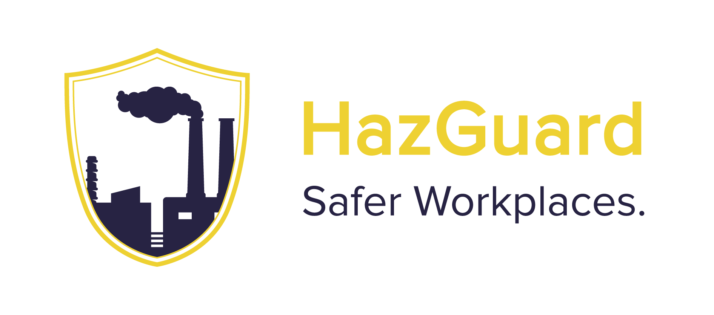

# HazGuard



We at HazGuard bring together companies across various industries on one page to help them share hazards and solutions that happen in their workplaces.
<br/>
<br/>
HazGuard is a web app, a one-stop solution to track all the hazards and their solutions in an industrial workplace across different companies, sectors and countries. If a hazard has occurred in your workplace and you solved it, then you can share it or find a solution by searching here.
<br/>

# Table of Contents

1. [Demo](#demo)
2. [Installation](#installation)
3. [Technology Stack](#technology-stack)
4. [Authors](#authors)
5. [License](#license)

# Demo

[Live Demo](https://www.hazguard.tech/)

Please Note:

1. We recommend using this app in Google Chrome.
2. We recommend using this app on laptop/desktop for the best possible experience as of now.

Test Credentials:

-   For User With Free Subscription
    -   Email: testuser1@pestoproject.com
    -   Password: 1234567890

-   For User With National Subscription
    -   Email: testuser2@pestoproject.com
    -   Password: 1234567890

-   For User With International Subscription
    -   Email: testuser3@pestoproject.com
    -   Password: 1234567890

# Installation

1. Clone the repo

    ```sh
    git clone https://github.com/pesto-students/hazguard-frontend-team1_sumit-srivastava.git
    ```

2. Set environment variables

    ```sh
    VITE_S3_BUCKET_NAME=
    VITE_S3_REGION_NAME=
    VITE_S3_ACCESS_KEY_ID=
    VITE_S3_SECRET_ACCESS_KEY=
    ```
3. Install NPM packages
    ```sh
    cd hazguard-frontend-team1_sumit-srivastava && npm install
    ```
4. Run
    ```sh
    npm run dev
    ```
5. Open http://localhost:3000 to view it in the browser

# Technology Stack

We used a tried and tested tech stack. This resulted in a fast, performant, and easily-extensible web app that should be fairly future-proof for the coming next several years. We used:

-   [React.js](https://reactjs.org/)
-   [Redux Toolkit](https://redux-toolkit.js.org/)
-   [Tailwind CSS](https://tailwindcss.com/)
-   [JWT Authentication](https://jwt.io/)
-   [Razorpay](https://razorpay.com/)
-   [Prettier](https://prettier.io/)

# Authors

-   Devansh Dalmia
    -   [LinkedIn](https://www.linkedin.com/in/devanshdalmia1/)
    -   [GitHub](https://github.com/devanshdalmia01/)
    -   [Email](mailto:devanshdalmia1@gmail.com)
-   Dharmik Abhangi
    -   [LinkedIn](https://www.linkedin.com/in/dharmik-abhangi/)
    -   [GitHub](https://github.com/Dharmik3107/)
    -   [Email](mailto:abhangidharmik@gmail.com)

# License

[MIT](https://opensource.org/licenses/MIT)
